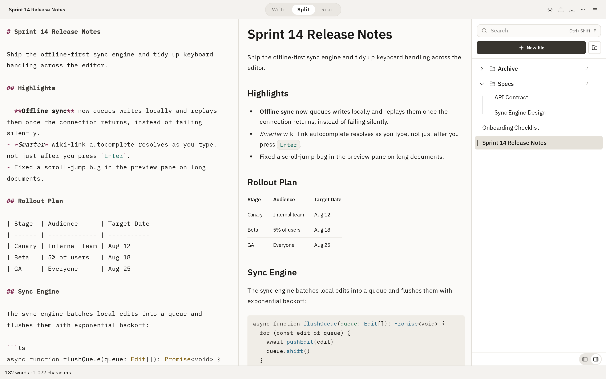
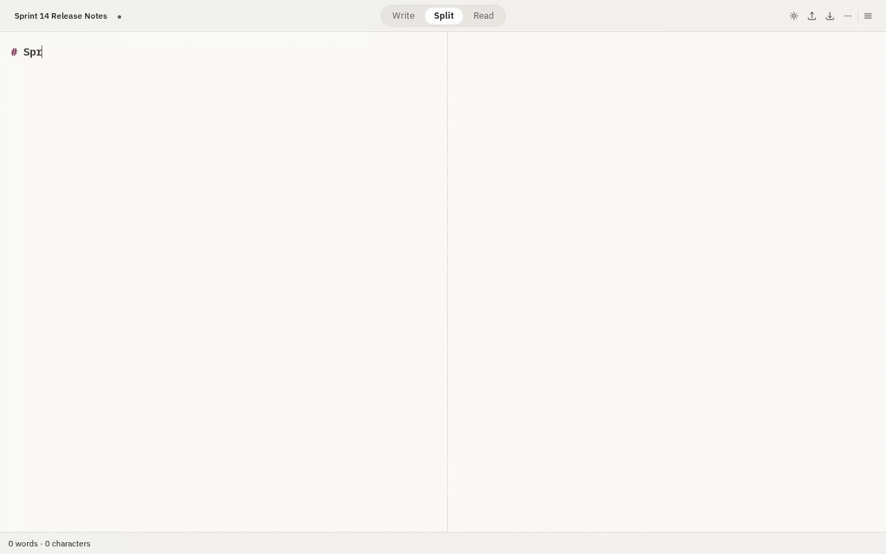
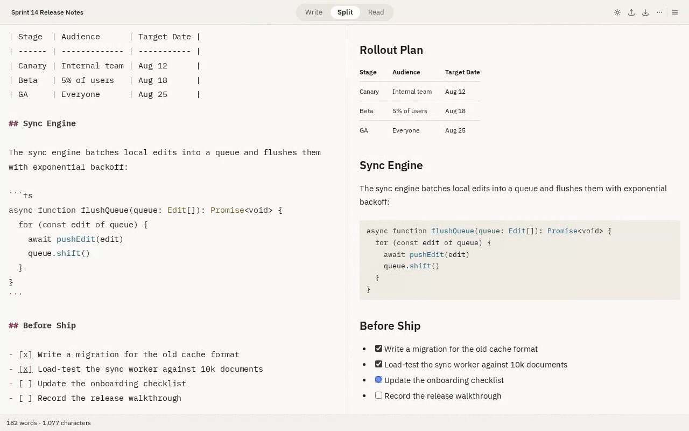
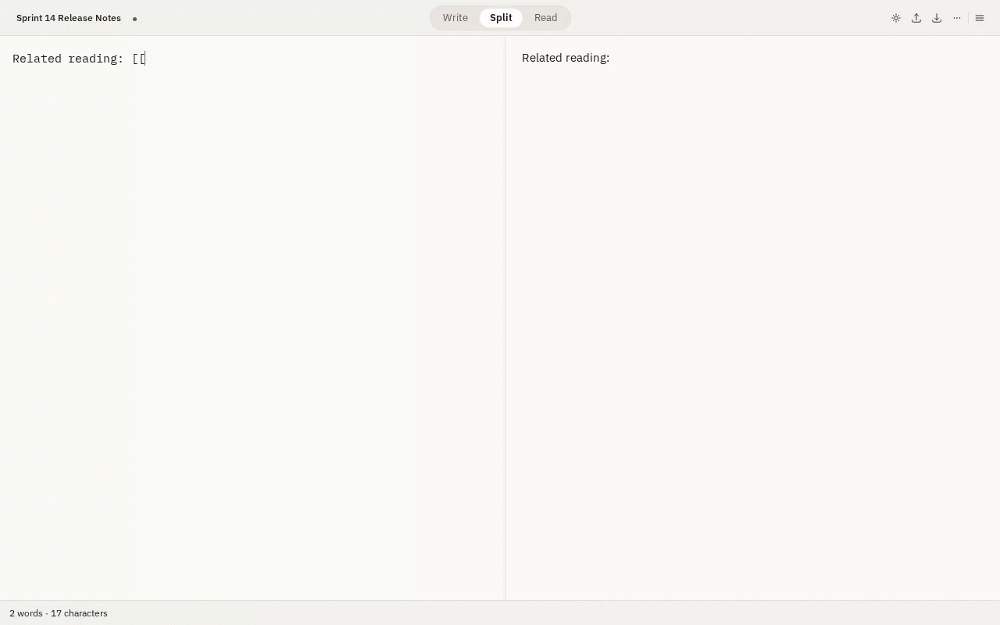
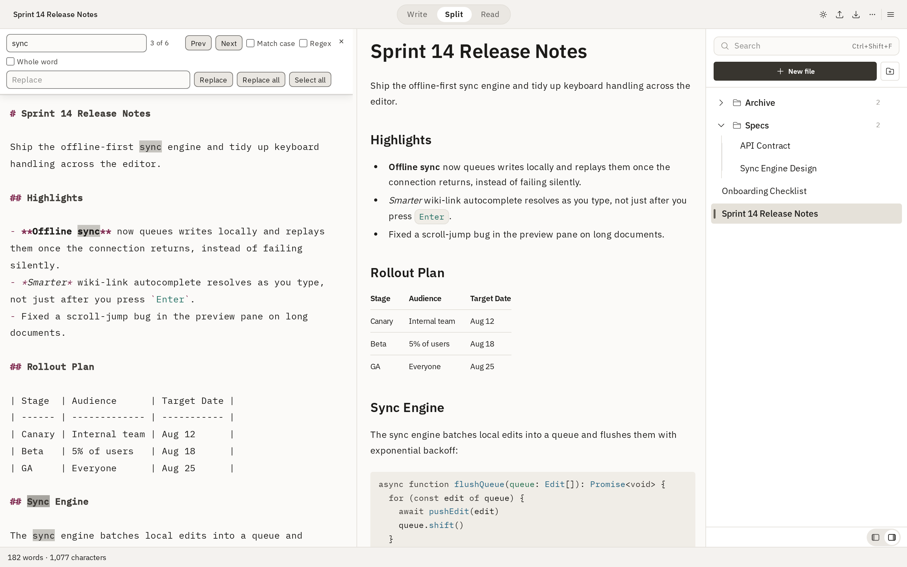
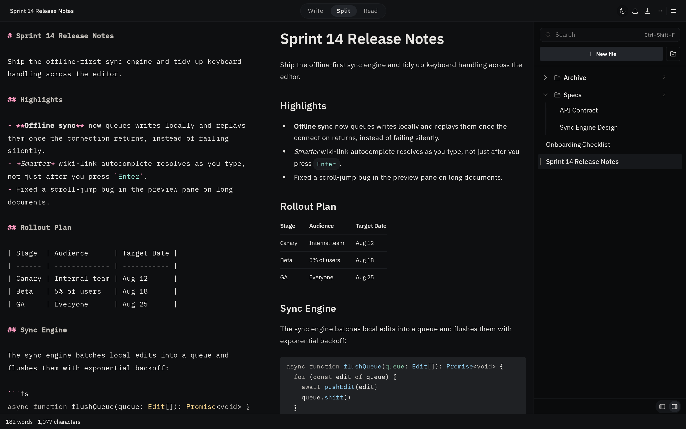
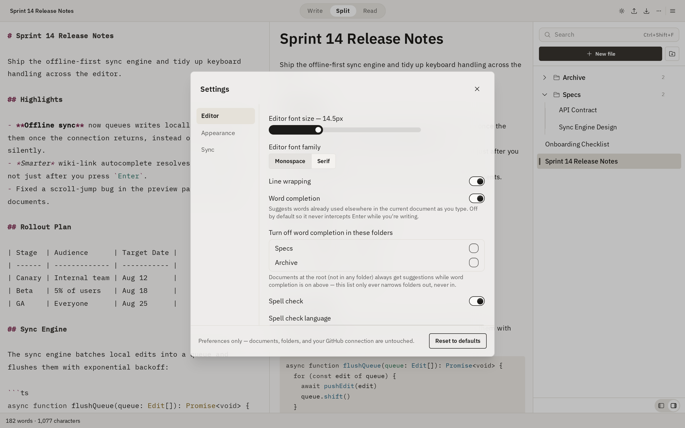

# powermd

A markdown editor that runs entirely in your browser. Write on the left, see
it rendered on the right, and keep everything on your own machine.

**[Try it →](https://markdown-editor-peach.vercel.app)**



Your documents live in IndexedDB and never leave the browser unless you
connect GitHub sync yourself. It installs as an app and works with no network
at all.

---

## Writing

The preview updates as you type, rendering GitHub Flavored Markdown —
tables, task lists, strikethrough, autolinks — with syntax highlighting and
Mermaid diagrams. Rendering happens in a Web Worker, so a long document never
makes typing stutter.



Three view modes: editor only, preview only, or both. The split is draggable,
and scrolling can be synchronised between the panes or left independent.

Formatting has a toolbar and shortcuts — bold, italic, underline,
strikethrough, links, inline code and code blocks, lists, quotes, tables and
headings.

### Task lists you can actually tick

`- [ ]` renders as a checkbox you can click. Ticking it edits the markdown,
so the document stays the source of truth and syncs like anything else.



### Linking documents together

`[[Document title]]` links one document to another. Typing `[[` suggests
titles and filters as you type; a link to a document that doesn't exist yet
is drawn differently and creates it when clicked — so you can write the link
before you write the page.



### Completing words you've already used

Optionally, typing suggests words that already appear in the document you're
in — no dictionary, nothing from elsewhere. It can be switched off for
particular folders, which matters if one of them holds a language you're
still learning.

---

## Finding things

`Ctrl+F` finds and replaces within the open document, with match case, whole
word and regular expressions.



`Ctrl+Shift+F` searches across every document by title and content.

---

## Organising

Documents sit in the sidebar and can be grouped into folders. Renaming,
moving and deleting are all inline. The panel docks to either side.

---

## Syncing to GitHub

Optional, and off until you set it up. Sign in with a GitHub App, choose a
repository and branch, and your documents and folders are pushed to it on an
interval.

It is **one-way**: this app writes to GitHub and never reads back. Editing a
file on GitHub won't change it here, and a later push may overwrite it.
Deleting a document locally leaves the file on GitHub untouched. It never
force-pushes.

---

## Appearance

Light and dark themes, or follow the system.



A soft-contrast option softens every surface — near-black becomes dark grey,
near-white becomes light grey — independently of which theme you're on.



Editor font family and size, reading width, line wrap, spell check and its
language, autosave interval and the sync interval are all configurable.

Colour choices are measured rather than eyeballed: text holds at least 4.5:1
and interface elements at least 3:1, in every combination of theme and soft
contrast.

---

## Offline

powermd is a progressive web app. Install it and it opens and edits with no
network. Pending syncs wait until you're back online, and a new version tells
you it's available rather than reloading under you.

---

## Running it yourself

```bash
npm install
npm run dev
```

Then open http://localhost:5173.

```bash
npm run build       # type-check and build
npm run preview     # serve the production build
npm test            # unit tests
npm run e2e         # end-to-end tests (real Chromium)
npm run lint
npm run typecheck
```

### Enabling GitHub sync

Sync needs a GitHub App of your own. Create one, then set:

| Variable                    | Where  | Purpose                           |
| --------------------------- | ------ | --------------------------------- |
| `GITHUB_APP_CLIENT_ID`      | server | Token exchange                    |
| `GITHUB_APP_CLIENT_SECRET`  | server | Token exchange — never bundled    |
| `VITE_GITHUB_APP_CLIENT_ID` | client | Starts the authorize flow         |
| `VITE_GITHUB_APP_SLUG`      | client | Optional; builds the install link |

See `.env.example`. The client secret is only ever read by the serverless
functions in `api/`; it is never exposed to the browser. The access token
travels in an `Authorization` header and is never logged or placed in a URL.

---

## How it's built

Vue 3 and TypeScript in strict mode, Effector for state, CodeMirror 6 for the
editor, unified/remark/rehype for rendering, Tailwind and DaisyUI for styling,
Vite for the build.

The code is organised by feature, with each feature owning its own model, UI
and logic. Features don't import each other's internals — anything that needs
two of them is wired in `src/app/wiring.ts`, and that rule is enforced by
ESLint rather than convention. `ARCHITECTURE.md` has the details.

Rendered HTML is sanitised before it reaches the DOM, and that boundary is
the same for the preview, exports and printing.

---

## Licence

MIT. See [LICENSE](LICENSE).
